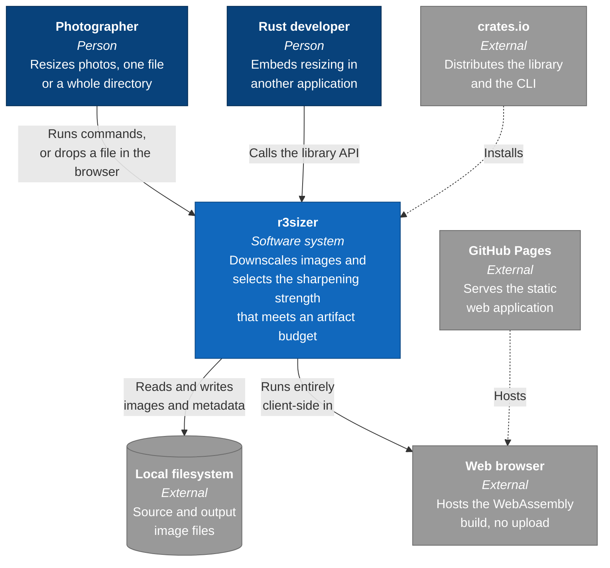
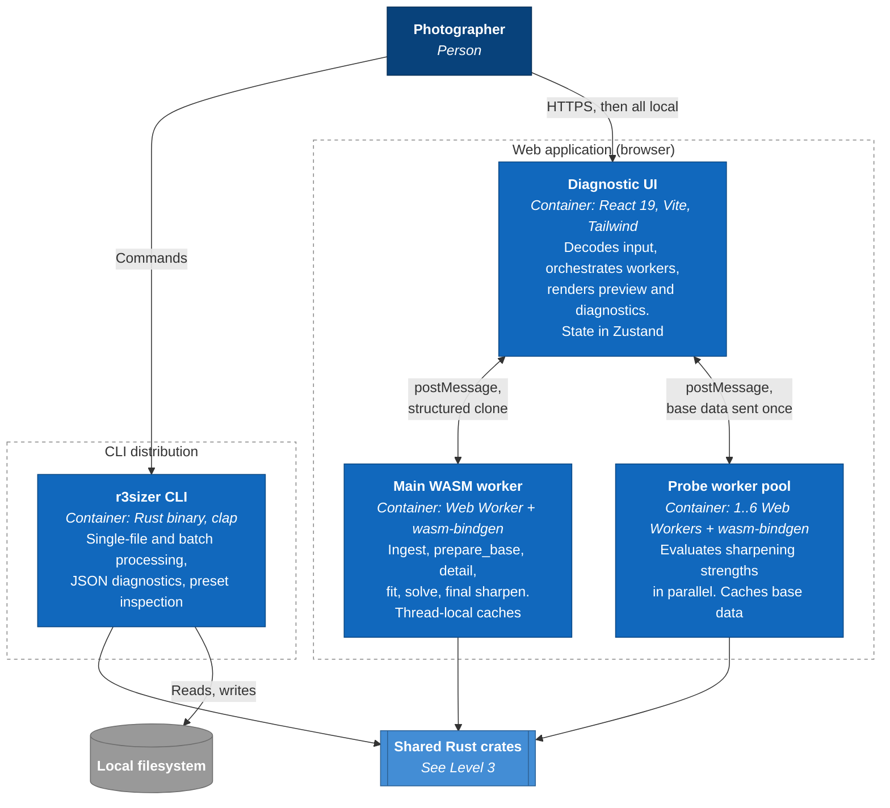
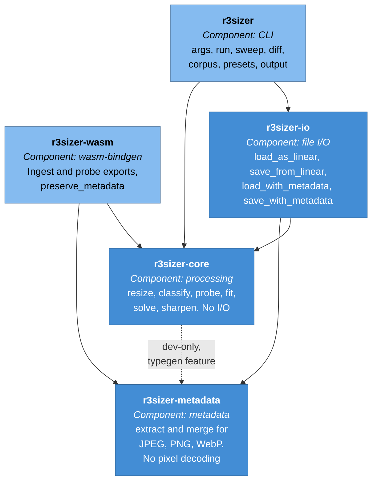
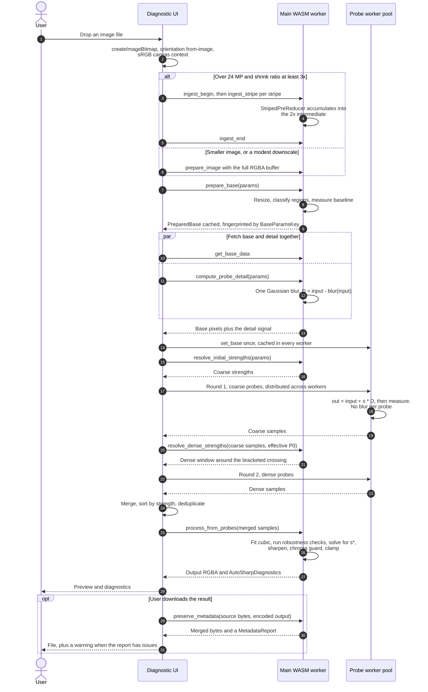
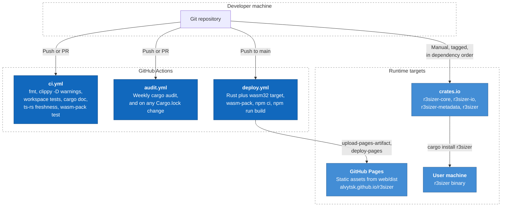

# r3sizer architecture

This document describes the structure of r3sizer with C4-style views. It covers
four levels: system context, containers, shared components, and one runtime
sequence. It closes with the deployment topology.

For the algorithm the system implements, read [`algorithm.md`](algorithm.md).
For stage-by-stage internals, read
[`pipeline_implementation.md`](pipeline_implementation.md).

**Diagram notation.** The diagrams use Mermaid `flowchart` syntax rather than
Mermaid's native `C4Context` blocks. The native blocks lay out poorly on GitHub
and offer no layout control. The C4 level of each diagram is named in its
heading.

---

## Level 1: System context

r3sizer selects a sharpening strength for a downscaled image automatically. A
user reaches it through one of two surfaces. Both surfaces run the same
processing core.

The system has no server component. It stores nothing and sends nothing over the
network. An image dropped into the web application never leaves the browser.

---

## Level 2: Containers

Four deployable or independently running units exist. The CLI is one process.
The web application is three units: a page and two kinds of Web Worker.

The pool size is `min(navigator.hardwareConcurrency, 6)`. The pool is optional.
The UI falls back to the main worker alone when the pool fails to start or any
parallel step throws.

---

## Level 3: Components (the shared Rust crates)

Five crates make up the workspace. The dependency direction is strict and
enforced by the manifests.

Two properties of this graph matter.

`r3sizer-core` performs no I/O. It accepts a `LinearRgbImage` and returns a
`ProcessOutput`. This lets the same code run in a CLI process, in a Web Worker,
and inside a future Tauri application without change.

The dashed edge is a development-only dependency behind the `typegen` feature.
It exists so the TypeScript exporter can emit the metadata contract types
alongside the core types into one `generated.ts`. A production build of
`r3sizer-core` never links metadata handling.

### Responsibilities

| Crate | Responsibility | Excluded by design |
|---|---|---|
| `r3sizer-core` | All pixel processing and strength selection | File access, encoding, metadata, async |
| `r3sizer-metadata` | EXIF, XMP, IPTC, ICC, text, density extract and merge | Pixel decoding, filesystem access |
| `r3sizer-io` | Decode, encode, and the metadata-aware load and save pair | Processing decisions |
| `r3sizer` | Argument parsing, batch orchestration, reporting | Processing decisions |
| `r3sizer-wasm` | The JavaScript boundary and thread-local caches | Processing decisions |

---

## Runtime view: interactive processing in the browser

This sequence shows the parallel two-pass path. It is the most involved flow in
the system. The CLI runs the same stages through the single-shot entry point
`process_auto_sharp_downscale`.

Three design points are visible in this sequence.

**The base is prepared once.** `prepare_base` costs roughly 1.5 seconds on a
24 MP image. `process_from_probes` costs roughly 0.5 seconds. A parameter change
that does not affect the base reuses the cached `PreparedBase`. The
`BaseParamsKey` fingerprint guards that reuse.

**The blur runs once, not once per probe.** The detail signal `D` does not depend
on the strength `s`. Each probe reduces to a multiply-add. This is why the base
data sent to the pool carries `detail`.

**Any parallel failure falls back.** `processImageParallel` catches every error
except cancellation and reruns the whole request on the main worker.

---

## Deployment

The web build runs entirely in CI. No local artifact is committed. The WebAssembly
module is built from source in the same job that builds the page.

Crate publishing is manual. There is no release workflow. Publish the crates in
dependency order. Read [`releasing.md`](releasing.md) for the procedure.

`r3sizer-wasm` sets `publish = false`. It ships only inside the web bundle.

---

## Cross-cutting constraints

| Constraint | Where it is enforced | Why |
|---|---|---|
| Pixels in `f32`, polynomial fit in `f64` | `fit.rs` | The Vandermonde matrix carries terms up to `s^6`. `f32` causes catastrophic cancellation |
| No clamping inside `sharpen.rs` | `sharpen.rs` | Out-of-range values are the artifact signal. Clamping happens once, at output |
| The downscaled base is never mutated during probing | `pipeline.rs` | Each probe allocates fresh output, so the base stays valid for the final apply |
| A fallback is not an error | `solve.rs` | When no root falls in the probe range, the best sample is used. The pipeline always returns a result, and reports how it chose |
| TypeScript types are generated, never handwritten | `ts-rs`, `typegen` feature | CI regenerates `generated.ts` and fails when the commit is stale |
| Metadata issues are reported, never silently dropped | `r3sizer-metadata` | The system never claims preservation it cannot verify |
| Peak memory is bounded for very large inputs | `ingest.rs` | Striped ingest holds one stripe plus the intermediate, not the full source |

---

## Where to read next

| Topic | Document |
|---|---|
| The selection algorithm, stage by stage | [`algorithm.md`](algorithm.md) |
| Data flow, allocations, and fallback logic | [`pipeline_implementation.md`](pipeline_implementation.md) |
| Confirmed findings against engineering approximations | [`assumptions.md`](assumptions.md) |
| Every CLI flag | [`cli.md`](cli.md) |
| Roadmap | [`future_work.md`](future_work.md) |
| Version, tag, and publish procedure | [`releasing.md`](releasing.md) |
